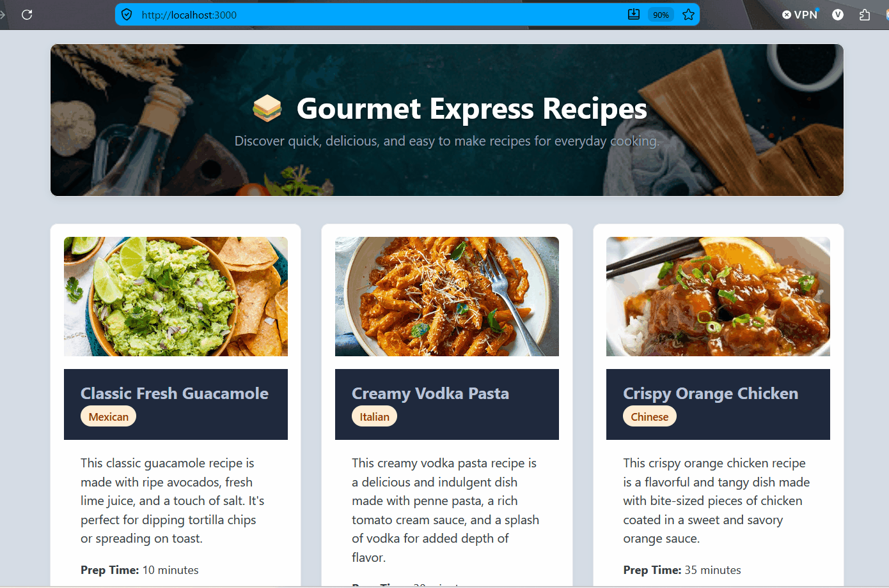

# WEB103 Project 1 - *Express Recipes*

Submitted by: **Victoria Zhunio**

About this web app: **Gourmet Express Recipes is a web application built with Node.js and Express that lets users browse quick and easy recipes. Users can view a grid of recipe cards showing key details like preparation time, cuisine, and difficulty, as well as click through to dynamic detailed views for each individual recipe.**

Time spent: **4** hours

## Required Features

The following **required** functionality is completed:

<!-- Make sure to check off completed functionality below -->
- [x] **The web app uses only HTML, CSS, and JavaScript without a frontend framework**
- [x] **The web app displays a title**
- [x] **The web app displays at least five unique list items, each with at least three displayed attributes (such as title, text, and image)**
- [x] **The user can click on each item in the list to see a detailed view of it, including all database fields**
  - [x] **Each detail view should be a unique endpoint, such as as `localhost:3000/bosses/crystalguardian` and `localhost:3000/mantislords`**
  - [x] *Note: When showing this feature in the video walkthrough, please show the unique URL for each detailed view. We will not be able to give points if we cannot see the implementation* 
- [x] **The web app serves an appropriate 404 page when no matching route is defined**
- [x] **The web app is styled using Picocss**

The following **optional** features are implemented:

- [x] The web app displays items in a unique format, such as cards rather than lists or animated list items

The following **additional** features are implemented:

- [x] Added custom CSS overrides to enforce a light theme, custom responsive grid (3 cards per row), and dark blue header banners inside cards.
- [x] Implemented a hero header with a full background food image and text overlay.

## Video Walkthrough

Here's a walkthrough of implemented required features:

<!-- Replace this with whatever GIF tool you used! -->
GIF created with ScreentoGif
<!-- Recommended tools:
[Kap](https://getkap.co/) for macOS
[ScreenToGif](https://www.screentogif.com/) for Windows
[peek](https://github.com/phw/peek) for Linux. -->

## Notes

Overriding default system dark mode settings in Pico CSS to enforce a clean light theme required using explicit CSS specificity and `data-theme="light"` configuration. Additionally, ensuring the custom CSS grid layout maintained exactly three cards per row without squishing content required fine-tuning responsive breakpoint media queries.

## License

Copyright [2026] [Victoria Zhunio]

Licensed under the Apache License, Version 2.0 (the "License"); you may not use this file except in compliance with the License. You may obtain a copy of the License at

> http://www.apache.org/licenses/LICENSE-2.0

Unless required by applicable law or agreed to in writing, software distributed under the License is distributed on an "AS IS" BASIS, WITHOUT WARRANTIES OR CONDITIONS OF ANY KIND, either express or implied. See the License for the specific language governing permissions and limitations under the License.